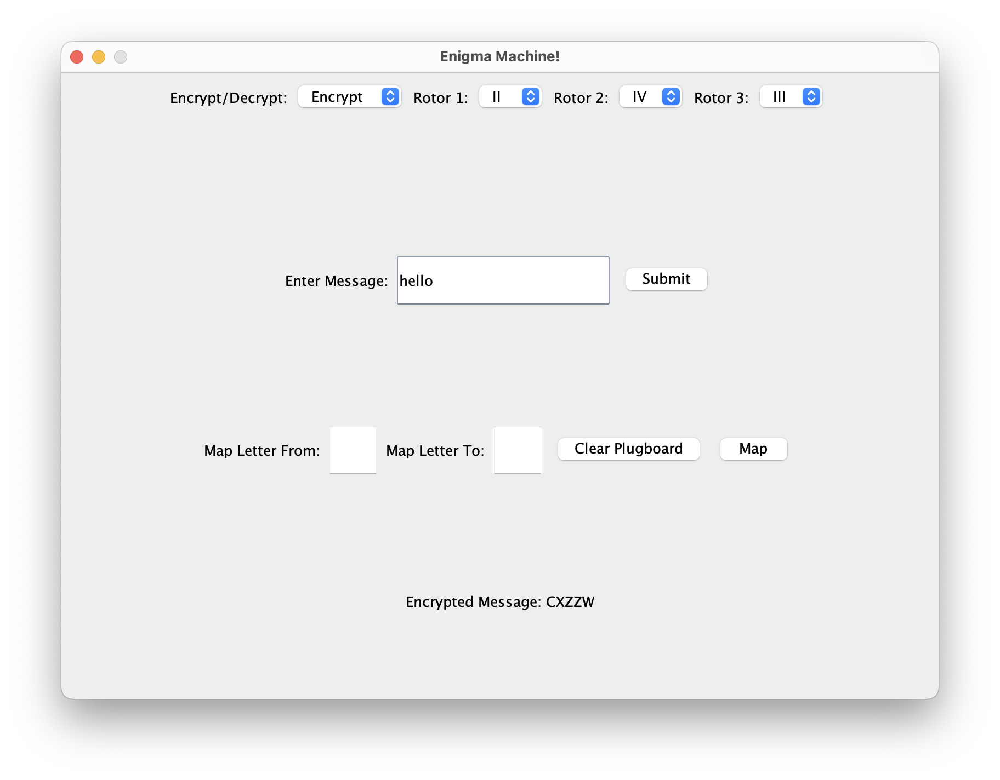
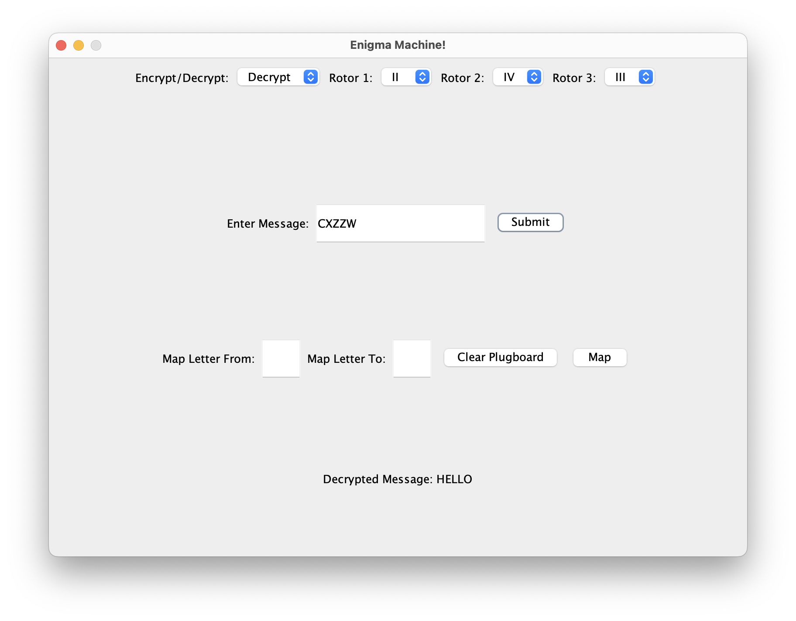
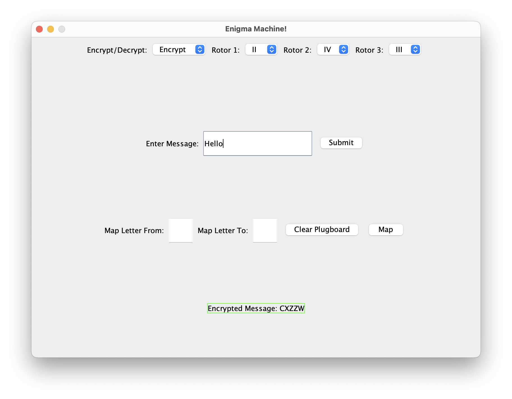

# ENIGMA MACHINE README

## Description
This project is a simple implementation of an Enigma machine.
The Enigma machine was used by the Germans to encrypt and decrypt messages during World War II. 
The Enigma machine was considered unbreakable until the British were able to crack the code using a machine called the Bombe. 
The Bombe was able to crack the code by using a series of rotors and a plugboard to decrypt the messages.
**Source: [Wikipedia](https://en.wikipedia.org/wiki/Bombe)**

*A simple example of the program encrypting a message.*
*A simple example of the program decrypting a message.*

## How to run
1. Clone the repository.
2. Open the project in IntelliJ or Eclipse.
3. Run the program from within the IDE.

## How to use
1. You set the mode of the machine to either `ENCRYPT` or `DECRYPT`.
2. You set the rotors to the desired positions. Each rotor has a different offset, so you can set the rotors to any position you want.
3. You can map two letters together using the plugboard. For example, you can map `A` to `B` and `B` to `A`. This will swap the two letters when encrypting or decrypting a message.
The plugboard is optional, so you don't have to map any letters if you don't want to.
4. You enter the message or code you want to encrypt or decrypt in the text field.
5. You can either hit the `Enter` key or click the `Submit` button.
6. Your encrypted or decrypted message will be displayed in the text area below the text field.
7. You can copy the message to your clipboard by clicking on the outputted message, you'll know it's copied successfully when a green border appears.

*A simple example of the program copying an outputted message to the clipboard.*

